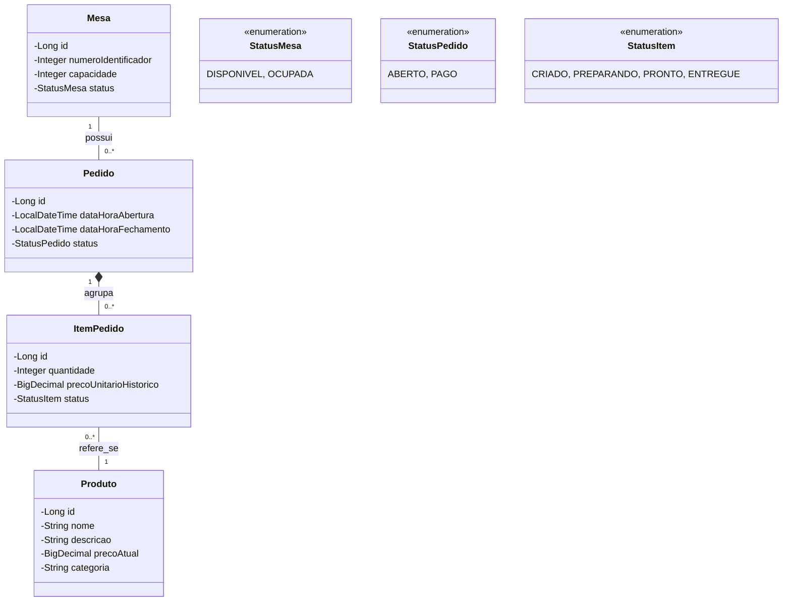
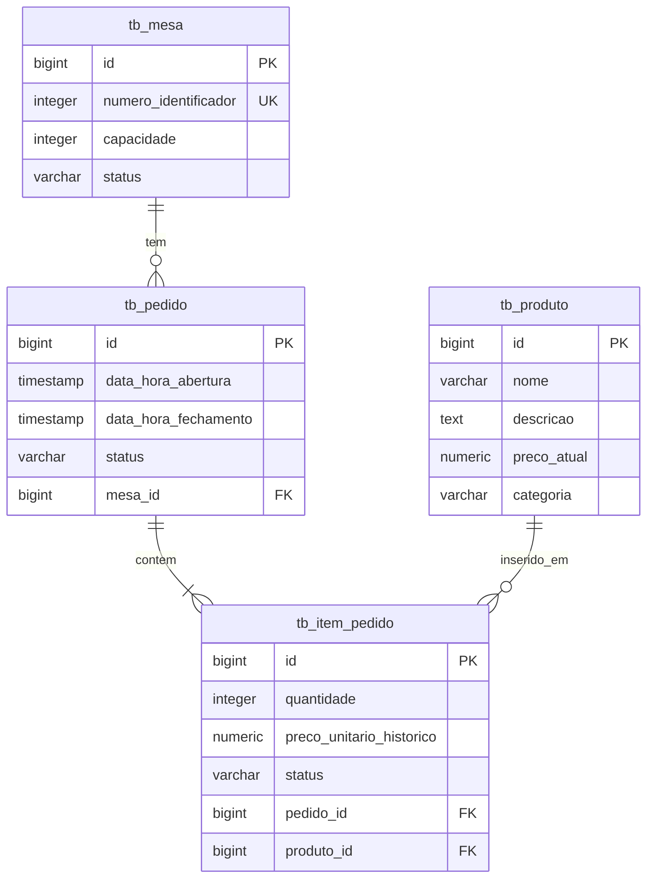

# 1. Nome do projeto

**FoodFlow API** - Sistema de Gestão de Pedidos e Mesas para Restaurantes

# 2. Visão geral

O **FoodFlow API** é um sistema de *backoffice* (backend) desenvolvido para orquestrar as operações dinâmicas do salão e da cozinha de um restaurante ou bar.

O contexto do sistema envolve o fluxo acelerado de atendimento: clientes chegam, ocupam mesas, fazem múltiplos pedidos ao longo da estadia, a cozinha prepara os itens, os garçons entregam e, no final, o caixa realiza o fechamento da conta.

O problema principal que o sistema resolve é a perda de pedidos anotados em papel, a divergência de valores na hora de fechar a conta e a falta de sincronia entre os garçons e a cozinha (ex: tentar cancelar um prato que já está no fogo). Como a camada de segurança foi abstraída nesta fase de estudos, a API foca inteiramente na estabilidade transacional e na precisão matemática das regras de negócio operando em rede local.

O objetivo principal é atuar como o cérebro do restaurante, garantindo que o estado de cada mesa, pedido e prato seja refletido em tempo real, fornecendo dados consistentes para o fechamento financeiro do atendimento.

# 3. Escopo do projeto

**Funcionalidades incluídas:**

* Gerenciamento do catálogo de Produtos (pratos, bebidas, sobremesas) e seus preços.
* Gerenciamento do salão de Mesas (capacidade e status de ocupação).
* Abertura de contas vinculadas a uma mesa.
* Consulta do estado atual da comanda e itens lançados.
* Lançamento de itens (pedidos parciais) na conta de uma mesa ativa.
* Máquina de estados para acompanhamento do preparo de cada item pela cozinha.
* Cancelamento/remoção de itens sob estrita validação de status de preparo.
* Fechamento da conta com cálculo automatizado de subtotal e taxa de serviço.

**Funcionalidades fora do escopo:**

* Autenticação e Autorização (Spring Security, JWT).
* Integração com gateways de pagamento (cartão de crédito, PIX).
* Controle de estoque e dedução de ingredientes por ficha técnica.
* Emissão de notas fiscais.

# 4. Tecnologias utilizadas

* **Java**
* **Spring Boot**
* **Spring Web**
* **Spring Data JPA & Hibernate**
* **PostgreSQL**
* **Maven**
* **Jakarta Bean Validation**

# 5. Requisitos funcionais

* **RF01** - O sistema deve permitir cadastrar categorias de produtos e produtos informando nome, descrição, preço atual e categoria.
* **RF02** - O sistema deve permitir a listagem do cardápio (produtos disponíveis).
* **RF03** - O sistema deve permitir cadastrar mesas informando o número identificador e a capacidade máxima de pessoas.
* **RF04** - O sistema deve permitir listar as mesas do salão e verificar seus status atuais.
* **RF05** - O sistema deve permitir abrir o atendimento de uma mesa, alterando seu status para `OCUPADA` e criando um "Pedido" central (comanda) para ela.
* **RF06** - O sistema deve permitir consultar a comanda atual de uma mesa ocupada, exibindo todos os itens e o subtotal parcial.
* **RF07** - O sistema deve permitir adicionar um ou mais itens (produtos e quantidades) ao pedido ativo de uma mesa.
* **RF08** - O sistema deve permitir que a cozinha avance o status de um item específico (de `CRIADO` para `PREPARANDO` e de `PREPARANDO` para `PRONTO`).
* **RF09** - O sistema deve permitir que o garçom informe que o item foi `ENTREGUE` na mesa.
* **RF10** - O sistema deve permitir a remoção de um item da comanda apenas se o preparo ainda não tiver sido iniciado.
* **RF11** - O sistema deve realizar o fechamento da conta, retornando o extrato detalhado com o subtotal dos produtos consumidos e a adição automática de 10% de taxa de serviço.
* **RF12** - O sistema deve permitir liberar a mesa após o pagamento, retornando seu status para `DISPONIVEL`.

# 6. Requisitos não funcionais

* **RNF01 (Qualidade e Padrões):** O código deve seguir os princípios de *Clean Code*, garantindo alta legibilidade e manutenção. O versionamento do repositório deve adotar a padronização do *Conventional Commits*. Essa estrutura refletirá um rigor técnico exigido por grandes empresas de tecnologia e consultorias de software de excelência (como JExperts ou ThoughtWorks University).
* **RNF02 (Padrões REST):** A comunicação deve respeitar a semântica HTTP, utilizando recursos plurais, paginação para listagens longas e os *Status Codes* adequados (200, 201, 204, 400, 404, 409, 422).
* **RNF03 (Isolamento de Domínio):** O tráfego de informações entre cliente e servidor deve ser feito única e exclusivamente através de classes DTO (Data Transfer Objects), protegendo as entidades do banco de dados.
* **RNF04 (Robustez):** Implementação de um `GlobalExceptionHandler` (`@RestControllerAdvice`) para padronizar as respostas de erro da API. O cliente nunca deve receber a *stack trace* do Java.
* **RNF05 (Validação):** Entradas de dados devem ser garantidas via *Bean Validation* antes de atingirem a camada de negócio (ex: valores de produtos não podem ser negativos, a capacidade da mesa deve ser maior que zero).

# 7. Regras de negócio

* **RN01 (Estado da Mesa):** Uma mesa só possui dois estados lógicos: `DISPONIVEL` ou `OCUPADA`. Não é possível abrir um atendimento para uma mesa que já se encontre `OCUPADA`.
* **RN02 (Máquina de Estados do Item):** Cada item lançado em um pedido possui o seu próprio ciclo de vida independente: `CRIADO` -> `PREPARANDO` -> `PRONTO` -> `ENTREGUE`. A transição deve ser estritamente sequencial.
* **RN03 (Regra de Cancelamento de Item):** Um item só pode ser removido da comanda da mesa se o seu status for exatamente `CRIADO`. Se o status for `PREPARANDO`, `PRONTO` ou `ENTREGUE`, o sistema deve bloquear a exclusão e retornar um erro de conflito, pois a cozinha já gastou insumos ou tempo.
* **RN04 (Congelamento de Preços):** O preço do produto no momento do pedido deve ser copiado e salvo no registro do `ItemPedido`. Alterações futuras no catálogo de produtos não podem alterar o valor de comandas passadas ou em andamento.
* **RN05 (Fechamento de Conta):** A conta só pode ser encerrada se todos os itens associados ao pedido estiverem no status `ENTREGUE`. Se houver itens pendentes na cozinha ou aguardando entrega, o fechamento deve ser bloqueado.
* **RN06 (Taxa Dinâmica):** O cálculo do total deve ser sempre a soma do (preço histórico * quantidade) de todos os itens, acrescido de 10% (0.10) de serviço no momento da requisição de fechamento.

# 8. Casos de uso

### Caso de Uso 01: Lançar Item na Comanda

**Nome:** Adicionar Produtos a uma Mesa Ocupada
**Ator:** Garçom
**Objetivo:** Registrar o pedido de um cliente atrelando-o à conta da mesa.
**Pré-condições:** A mesa deve existir e estar com o status `OCUPADA` (com um pedido/comanda aberto). O produto selecionado deve estar ativo no catálogo.
**Fluxo principal:**

1. O ator envia o ID do Pedido ativo e uma lista contendo os IDs dos produtos e as respectivas quantidades.
2. O sistema busca a comanda (Pedido) correspondente.
3. O sistema valida se os produtos informados existem no catálogo.
4. O sistema cria os registros de `ItemPedido`, copiando o preço unitário do momento, definindo o status inicial como `CRIADO`.
5. O sistema vincula os itens à comanda.
6. O sistema retorna o recibo de inclusão com o código HTTP 201 Created.

**Fluxos alternativos:**

* *Passo 2 (Pedido Inexistente ou Fechado):* Se o pedido não existir ou já estiver `PAGO`, aborta a operação e lança exceção com HTTP 404 ou 409.

### Caso de Uso 02: Fechamento de Mesa

**Nome:** Solicitar Conta da Mesa
**Ator:** Caixa/Garçom
**Objetivo:** Obter o extrato final com totais calculados e encerrar o pedido.
**Pré-condições:** O pedido deve estar aberto.
**Fluxo principal:**

1. O ator solicita o fechamento informando o número da mesa.
2. O sistema verifica a existência de um pedido `ABERTO` para a mesa.
3. O sistema verifica o status de todos os itens do pedido.
4. O sistema calcula o subtotal e o valor da taxa de 10%.
5. O sistema altera o status do Pedido para `PAGO` e registra a data/hora do fechamento.
6. O sistema altera o status da Mesa para `DISPONIVEL`.
7. O sistema retorna o objeto DTO final do extrato com HTTP 200 OK.

**Fluxos alternativos:**

* *Passo 3 (Itens Pendentes):* Se existir algum item com status diferente de `ENTREGUE`, o sistema acusa erro de negócio e bloqueia o fechamento com HTTP 422 Unprocessable Entity.

# 9. Modelo de domínio

* **Produto:**
* **Responsabilidade:** Representar os itens vendáveis do restaurante (menu).
* **Atributos:** ID, Nome, Descrição, PrecoAtual, Categoria.


* **Mesa:**
* **Responsabilidade:** Representar a unidade física de acomodação do salão.
* **Atributos:** ID, NumeroIdentificador, Capacidade, Status (Enum: DISPONIVEL, OCUPADA).
* **Relacionamentos:** Possui relacionamento de *Um-Para-Muitos* com Pedido.


* **Pedido (Comanda):**
* **Responsabilidade:** Agrupar todos os consumos de uma mesa durante uma sessão de atendimento.
* **Atributos:** ID, DataHoraAbertura, DataHoraFechamento, StatusPedido (Enum: ABERTO, PAGO).
* **Relacionamentos:** Pertence a *Muitas-Para-Uma* Mesa; Agrupa *Um-Para-Muitos* ItensPedido.


* **ItemPedido:**
* **Responsabilidade:** Registrar a relação entre um Produto consumido e a quantidade, travando o preço e acompanhando a preparação.
* **Atributos:** ID, Quantidade, PrecoUnitarioHistorico, StatusItem (Enum: CRIADO, PREPARANDO, PRONTO, ENTREGUE).
* **Relacionamentos:** Pertence a *Muitos-Para-Um* Pedido; Refere-se a *Muitos-Para-Um* Produto.


# 10. Diagrama de domínio UML



# 11. Modelo relacional do banco de dados



# 12. API REST

### 12.1. Cadastros Básicos (Administração)

**1. Cadastrar Produto**

* **Método:** `POST`
* **Rota:** `/api/produtos`
* **Objetivo:** Inserir um novo prato ou bebida no cardápio.
* **Códigos HTTP:** `201 Created`, `400 Bad Request`.

**2. Listar Produtos**

* **Método:** `GET`
* **Rota:** `/api/produtos`
* **Objetivo:** Retornar o cardápio disponível.
* **Códigos HTTP:** `200 OK`.

**3. Cadastrar Mesa**

* **Método:** `POST`
* **Rota:** `/api/mesas`
* **Objetivo:** Adicionar uma nova mesa física ao salão.
* **Códigos HTTP:** `201 Created`, `400 Bad Request`.

**4. Listar Mesas**

* **Método:** `GET`
* **Rota:** `/api/mesas`
* **Objetivo:** Retornar as mesas e seus status (DISPONIVEL ou OCUPADA).
* **Códigos HTTP:** `200 OK`.

### 12.2. Operações de Salão e Cozinha

**5. Abrir Atendimento de Mesa**

* **Método:** `POST`
* **Rota:** `/api/mesas/{numeroMesa}/atendimentos`
* **Objetivo:** Iniciar a comanda de uma mesa recém-ocupada.
* **Response:** Objeto DTO do Pedido gerado.
* **Códigos HTTP:** `201 Created`, `404 Not Found` ou `409 Conflict` (se a mesa já estiver ocupada).

**6. Consultar Comanda Atual**

* **Método:** `GET`
* **Rota:** `/api/mesas/{numeroMesa}/atendimentos/atual`
* **Objetivo:** Retornar os itens parciais de uma mesa antes do fechamento.
* **Códigos HTTP:** `200 OK`, `404 Not Found` (se a mesa estiver disponível/sem pedido aberto).

**7. Adicionar Itens na Comanda**

* **Método:** `POST`
* **Rota:** `/api/pedidos/{pedidoId}/itens`
* **Request Body:**

```json
[
  { "produtoId": 15, "quantidade": 2 },
  { "produtoId": 3, "quantidade": 1 }
]

```

* **Códigos HTTP:** `201 Created`, `400 Bad Request`, `404 Not Found`.

**8. Atualizar Status de Preparo (Cozinha/Garçom)**

* **Método:** `PATCH`
* **Rota:** `/api/itens/{itemId}/status`
* **Request Body:**

```json
{ "novoStatus": "PREPARANDO" }

```

* **Códigos HTTP:** `200 OK` ou `422 Unprocessable Entity` (se a transição não obedecer à regra sequencial).

**9. Remover Item da Comanda**

* **Método:** `DELETE`
* **Rota:** `/api/itens/{itemId}`
* **Objetivo:** Cancelar o pedido de um prato.
* **Códigos HTTP:** `204 No Content`, `404 Not Found` ou `409 Conflict` (se a cozinha já tiver iniciado o preparo).

**10. Fechar Conta (Extrato Final)**

* **Método:** `POST`
* **Rota:** `/api/mesas/{numeroMesa}/fechamento`
* **Response (DTO Consolidado):**

```json
{
  "pedidoId": 45,
  "numeroMesa": 12,
  "itens": [
     { "nome": "Hamburguer Artesanal", "quantidade": 2, "total": 70.00 }
  ],
  "subtotal": 70.00,
  "taxaServico": 7.00,
  "totalPagar": 77.00
}

```

* **Códigos HTTP:** `200 OK`, `404 Not Found` ou `422 Unprocessable Entity` (se houver itens pendentes de entrega).

# 13. Arquitetura do projeto

A aplicação será construída sobre a arquitetura tradicional em camadas do ecossistema Spring:

* **Controller Layer (`controller`):** Intercepta o tráfego de rede, delega validações `@Valid`, desembrulha o JSON em classes RequestDTO e repassa para a camada de serviços. Retorna classes ResponseDTO encapsuladas em `ResponseEntity`.
* **Service Layer (`service`):** Concentra o "cérebro" da aplicação. Realiza validações de domínio (ex: verificar se a mesa está ocupada, realizar contas matemáticas de taxas). Utiliza a anotação `@Transactional` para evitar que operações pela metade sejam salvas no banco em caso de erros no processo.
* **Repository Layer (`repository`):** Contratos baseados no `JpaRepository`. Será responsável pelas *queries* de leitura e modificação no PostgreSQL. Onde for conveniente, deve usar `@Query` e JPQL para consultas específicas.
* **Entity Layer (`entity`):** Objetos de modelo altamente acoplados ao banco relacional. Utilizam mapeamentos como `@ManyToOne` e geradores de auto-incremento (Identity) ou UUID.
* **DTO Layer (`dto`):** Objetos de transporte de dados puros (Records do Java).
* **Exception Layer (`exception`):** Camada vital para tratar exceções de negócio criadas (ex: `MesaOcupadaException`, `ItemEmPreparoException`) e capturá-las no `ControllerAdvice`, traduzindo-as para mensagens consistentes de erro.

**Fluxo Vertical Padrão:**
`Controller` (Recebe Requisição HTTP) ➔ `Service` (Processa Negócio e Cálculos) ➔ `Repository` (Busca/Persiste no BD) ➔ `Database` (PostgreSQL). O fluxo inverso realiza o empacotamento em DTO para retorno ao cliente.

# 14. Desafios técnicos do projeto

Este projeto exige a consolidação dos seguintes tópicos para atingir nível intermediário:

* **Controle de Estado:** Gerenciar corretamente as lógicas condicionais complexas com base nos Enums de status da Mesa, do Pedido e, principalmente, do ItemPedido.
* **Isolamento de Alterações:** Compreender que o `precoAtual` do produto pode mudar no catálogo com o tempo, mas a aplicação deve persistir o `precoUnitarioHistorico` na tabela associativa do banco de dados travado no momento exato do pedido.
* **Validação Personalizada em Cascade:** Garantir que ações na raiz (fechar o pedido) façam a leitura e validação do status de toda a lista de itens "filhos" (agregação).
* **Tratamento de Exceções Dedicado:** A robustez recairá fortemente no mapeamento correto do `GlobalExceptionHandler`, para que clientes consumindo a API saibam o motivo exato de uma recusa, como "Status do prato já está na etapa de PREPARANDO".
* **Sincronia Relacional (JPA):** O uso do mapeamento ORM bidirecional e como evitar chamadas excessivas ao banco de dados ao buscar um Pedido e todos os seus Itens (Problema do *N+1 Select*).

# 15. Critérios de conclusão

O projeto estará plenamente pronto para figurar como um excelente *case* prático no seu portfólio assim que:

* For possível levantar o ambiente de banco de dados e rodar a API nativamente no seu ambiente (como no Ubuntu 24.04 LTS).
* As chamadas HTTP conseguirem transitar completamente um pedido, criando produtos, abrindo a mesa, adicionando itens, avançando a cozinha e finalizando o pagamento da conta final com as taxas calculadas perfeitamente.
* Exceções intencionais de violação da máquina de estados (ex: tentar apagar um prato que já está sendo feito) responderem com erros em formato JSON amigável e código de status condizente, sem quebrar a execução geral.
* A documentação estiver descrita detalhadamente no seu README final.
* O histórico no Git evidenciar padronização nos commits (*Conventional Commits*) e evolução incremental da lógica de negócio.